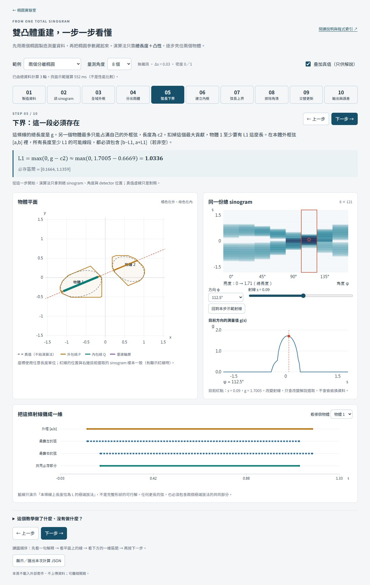

# Two-body reconstruction, step by step

從兩個橢圓的**單一總 sinogram**出發，理解雙凸體的內外包絡演算法。

建議先讀網站的[單凸體七步教學](../single/index.html)。單凸體的 core/envelope 原理可直接使用總弦長；雙凸體頁面增加的是「可分離初始化」及由 `g=r1+r2` 推導各體安全上下界。Kölzow–Kuba–Volčič (1989) 處理的是單凸體，本頁不把雙體延伸歸於該論文。

這是可以放進 GitHub Pages 的零相依靜態教學，不是新的性能比較研究。介面用中文，程式函式與註解用英文。

## 先打開，再讀程式

直接開啟本資料夾的 `index.html`，或從網站根目錄啟動：

```bash
python -m http.server 4281 --bind 127.0.0.1
```

然後開啟 `http://127.0.0.1:4281/tutorial/`。不需 npm 安裝、不使用 FBP、不需要 GPU。部署既有 GitHub Pages 專案時，`tutorial/` 隨網站一起發布；新增檔案本身不代表已推送到 GitHub。

建議第一次保留預設 8 角度，依次按「下一步」，到第 5 步仔細看下方的一維區間，第 8 步看局部放大，第 9 步拖動輪數。不要先調整所有選項。



## 問題模型

- 未知物體是兩個互不相交、有內部的緊凸體，密度為 1。
- 已知包含物體的視野 `[-1.8, 1.8]^2`；測量無雜訊、完整 detector 覆蓋。
- detector spacing 為 0.03，預設 121 個 detector；角度均勻分布在 `[0,π)`。
- 每個物體在每個量測方向的投影寬度須大於 detector spacing。
- 預設兩個橢圓半軸分別 `(0.54, 0.32)`、`(0.43, 0.29)`；中心 `(-0.63,-0.16)`、`(0.60,0.22)`；旋轉角 `0.28`、`-0.45` radians。它們的 x 投影已分開，因此物體不相交。
- 失敗案例是半徑 0.42 的兩個圓（也是橢圓），中心距 0.841，分離方向為 `π/16`。它們不相交，但目前取樣可能無法解析間距。

`phantom.js` 使用直線與橢圓的二次方程解析求交，沒有先把真值變成像素。因為這兩組預設物體都不相交，兩體弦長相加等於二值聯集資料。任意交疊橢圓不能直接沿用這個相加模型。

## 最重要的資料隔離

```js
// Simulator: knows ellipses, but returns only measurement data.
const data = EllipsePhantom.makeData(EllipsePhantom.demo, 8);

// Reconstruction: receives NO ellipses, true split line or component sinograms.
const result = TwoBodyGeometry.reconstruct(data, { extent: 1.8, rounds: 3 });
```

`data` 只有 `total`、`angles`、`detector` 三個欄位。`geometry.js` 不匯入 `phantom.js`。真值疊圖、初始資料解說與測試檢查都在重建之外；關掉真值顯示不會改變結果。頁面上的「物體 1」按初始化 anchor 方向的投影順序命名，不一定是生成器原來的陣列順序。

## 十步圖解與函式對照

| 步驟 | 你要理解的事 | 主要函式 |
|---|---|---|
| 1. 製造資料 | 線穿過兩體，只量總長度 `g=r1+r2` | `phantom.chord`, `makeData` |
| 2. 總 sinogram | 一列對應一個角度；一個樣本對應一條線 | `tutorial.drawSinogram`, `drawProfile` |
| 3. 全域外框 | 每個方向把正值樣本兩端向外擴一格，取條帶交集 | `initialize`, `strip` |
| 4. 分出兩體 | 找兩段正值，中間至少兩個零樣本；其他方向只接受唯一可行配對 | `positiveRuns`, `initialize` |
| 5. 弦長下界 | `L1=max(0,g-c2)`，另一體最多貢獻 `c2` | `rayBounds` |
| 6. 建立內框 | 外弦 `[a,b]` 中必存 `[b-L,a+L]`，收集後取凸包 | `deriveInner`, `hull` |
| 7. 弦長上界 | `U1=g-q2`，另一體至少貢獻 `q2`；已知內弦 `[a,b]` 時真弦落在 `[b-U,a+U]` | `rayBounds`, `refine` |
| 8. 排除角落 | 外點 `z` 與內框產生遠離內框的禁區；裁切後取凸包 | `coneGeometry`, `excludeShadow` |
| 9. 交替更新 | 一輪內固定內框裁外框，再擴大內框；保留所有舊內部點 | `refine` |
| 10. 輸出與誤差 | 所有內外點對的中點取凸包；兩個結果取聯集 | `midpoint`, `enclosureBound` |

### 為什麼必存區間是 `[b-L,a+L]`？

若外框弦是 `[0,10]`，而真實弦至少長 8，最靠左的長 8 線段是 `[0,8]`，最靠右的是 `[2,10]`。無論怎麼放，`[2,8]` 都必須存在。

一般地，真弦 `[u,v]⊆[a,b]` 且 `v-u≥L`，所以 `u≤b-L`、`v≥a+L`。當 `b-L≤a+L`，共同區間確實包含於真弦。當下界太短、共同區間為空，這條規則不能提供內部點。實作為避免退化，只收集正長度區間。

### 為什麼外部點可以排除一片區域？

若已知 `Q⊆D` 且 `z∉D`，任何點 `x` 若滿足 `z∈conv(Q∪{x})`，就不可能在凸體 `D` 內，否則凸性會強迫 `z∈D`。

這些 `x` 形成禁區 `C={z+t(z-q): q∈Q, t≥0}`，方向是從 Q 穿過 z 後**向外延伸**，不是往 Q 裡面刪。網頁保存一筆實際發生、且另一體有正內弦的裁切，顯示裁切前後與局部放大；沒有手工畫出假的迭代輪廓。

有限多邊形實作保留禁區邊界，再對兩個半平面裁切結果的聯集取凸包。這是保守更新，凸化可能把部分已刪區域補回；一次排除不一定能嚴格縮小外框。

### 誤差上界到底保證什麼？

如果始終有 `Qi⊆Di⊆Pi`，取 Minkowski 中點 `Dhat_i=(Qi+Pi)/2`，則兩體聯集重建的 Hausdorff 誤差不超過：

`epsilon = 0.5 * max(dH(P1,Q1), dH(P2,Q2))`。

因為 Q、P 是巢狀凸多邊形，`dH(P,Q)` 等於 P 的各頂點到 Q 的距離最大值，可以直接計算，不需真值。Minkowski 中點不是相同編號頂點的平均；此實作把所有內外頂點對的中點取凸包。

這是**以包含關係成立為前提**的界。JavaScript 使用一般浮點數和數值裕量，並未實作嚴格區間算術。不得把畫面數值稱為已通過嚴格機器認證。中點不一定精確重現所有 Radon 樣本；包絡界下降，也不代表中點的真實誤差每輪下降。

## 重建失敗會怎麼處理？

`status: 'no-anchor'`：沒有可解析的兩段分離投影。

`status: 'no-inner'`：必存點的凸包沒有二維面積。

偵測到非有限值、負測量、邊界 detector 截斷或不一致配對時，直接報錯。不用橢圓真值、真實切割線、機器學習或其他額外資訊補救。沒有 anchor 是**這個演算法的初始化失敗**，不是一般重建不可能性的證明。

## 與 Python 研究原型的關係

這是以下本機研究函式的純 JavaScript 教學移植，不修改原來的研究程式或實驗結果：

- `scripts/research_chain_audit.py`: `data_outer_polygon`, `safe_isolated_outer`。
- `scripts/validate_geometric_completion.py`: `derive_inner`, `exclude_shadow`, `refine_enclosures`, `minkowski_midpoint`。

差異明列如下：

1. 教學使用解析雙橢圓資料、detector spacing 0.03，研究驗證資料不只有橢圓。
2. 二維包絡可行性同時檢查面積，而不是只算頂點個數。
3. 教學按角度→detector→物體→兩個外點掃描；Python 原型為角度→物體→detector→外點。保守凸化可能使順序影響結果；不宣稱兩份程式逐頂點相同。
4. 保存初始化及各輪多邊形、必存線段與實際裁切事件，供教學回放。
5. 保留原型的下界 `2e-10`、上界 `1e-8` 與外點 `1e-8` 裕量；這些是數值防護，不是新增雜訊模型。

## 測試與檔案

使用 Node.js 18 或更新版本，在本網站根目錄執行：

```bash
node --test tutorial/geometry.test.cjs
```

測試涵蓋：解析弦長與面積、凸包與半平面、必存區間、Minkowski 中點、禁區方向、不發生嚴格收縮的情況、初始化失敗，以及 4／8／16 角度端到端包含檢查。

外框包含橢圓的測試：對每條多邊形邊，使用橢圓**解析支撐函數**檢查整個橢圓都在內；不是只抽幾個邊界點。內框包含於橢圓的測試：所有頂點滿足橢圓方程，再由凸性推出整個內框在內。真值只在測試端使用。

另外以 2048 個支撐方向檢查輸出誤差與界的關係，這一項是抽樣診斷，不能稱為精確連續 Hausdorff 誤差。這些測試不是獨立的性能測試集。附帶的 GitHub Actions 會在推送後執行同一套幾何測試；本次僅在本機驗證，未宣稱遠端工作流程已通過。

| 檔案 | 用途 |
|---|---|
| `index.html`, `tutorial.css` | 逐步解說與響應式版面 |
| `tutorial.js` | 選取樣本、繪圖、公式數值與步驟回放 |
| `geometry.js` | 不知道真值的通用雙凸體重建 |
| `phantom.js` | 解析橢圓資料生成，與重建分離 |
| `geometry.test.cjs` | 幾何與端到端測試 |

按「顯示／匯出本次計算 JSON」可查看當前數據、所有中間包絡及狀態，再使用「儲存 JSON 檔案」。若內建瀏覽器不支援下載，完整 JSON 仍會顯示，可複製另存。檔案中的 `simulationOnly` 明確分開保存真值，不是演算法輸入。

## 文獻歸屬

內核／外包絡與凸性幾何排除不是本專案首創，參見 Kölzow, Kuba, Volčič (1989), [An algorithm for reconstructing convex bodies from their projections](https://doi.org/10.1007/BF02187723)。這個教學解釋的是目前研究中的**雙體總弦長限制＋幾何包絡更新**，不宣稱原創性已確認，也不宣稱優於 FBP、SIRT、TVR-DART 或 DALM。
